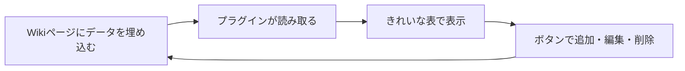

## はじめに

AWS Healthのイベント（AWSから届くメンテナンスや障害のお知らせ）を、PukiWikiで管理していました。最初はページに手で書き込むだけのシンプルなやり方だったのですが、数が増えてくると、だんだん管理が大変になってきます。

対応が済んだイベントは「削除履歴」として別ページに移していたのですが、消すたびにいちいちページ間で移動させるのが地味に面倒。そこで「もっとスマートに管理できないか」と思って、プラグインを自作することにしました。

こうなりました（データは加工しています）。


## どう作ったか：HTML埋め込み → プラグイン自作へ

最初は、PukiWikiのページにHTMLを直接埋め込んで、見やすい表を作ろうと考えていました。ところが、これがうまくいきません。PukiWikiの設定で**複数行のデータを埋め込む機能が既定で無効**になっていて、思ったように書けなかったのです。

設定を変えれば実現できるらしい、とも分かりました。でも、その方法には引っかかる点が2つありました。

- PukiWikiを**バージョンアップしたときに使えなくなる**おそれがある
- 設定や書き方を理解している人でないと、**ページの編集が難しくなる**

これだと、後々の管理で困ります。そこで、**プラグインとして自作する**ことにしました。プラグインなら、**ファイルを1つ移動するだけで別の環境にも持っていける**ので、移行や引き継ぎがとても簡単になります。

## データはWikiに埋め込む

今回は、手軽に組めること、そして**データをそのままバックアップしておけること**を重視しました。そこで、データはWikiページの中に埋め込み、それをプラグインが読み取って表示・編集する、という形にしました。

PukiWikiには、**行頭が `//` で始まる行は画面に表示されない**という仕組みがあります。これを使って、イベント1件を1行のデータとしてページの中にそっと隠して持たせます。

```
#awshealth
//{cat:"スケジュール",t:"RDS planned lifecycle event",svc:"RDS",s:"2026/07/31",st:"今後",rg:"ap-northeast-1"}
```

先頭の `#awshealth` がプラグインの呼び出しで、その下の `//` の行がデータです。読者には、プラグインが描いたきれいな表だけが見えて、その裏でデータが本文に並んでいる、という形です。

データがページの中にあるので、**Wikiの編集履歴やバックアップがそのままデータのバックアップになる**のも、ねらいどおりでした。



## やってみて良くなったこと

ここが一番伝えたいところです。プラグインにしたことで、管理が目に見えて楽になりました。

- **各項目をスリムに表示**できるようにして、ぱっと見で確認しやすくなった
- これまで**リストと詳細を別々に表示**していたのを、**1つにまとめられた**。行を開けばそのまま詳細が見える
- **削除履歴も同じページ**に置けるようになった。それでいて、表示はごちゃつかず視認性は保ったまま
- これまで手作業でページ間を移動させていた**削除や追加が、ボタン1つ**でできるようになった

操作が手作業からボタンに変わっただけでも、**作業がぐっと速くなり、移動ミスのような取り違えも減りました**。

そして地味に効いているのが、**追加の手軽さ**です。AWSの画面に出ている内容を**コピーして貼り付け、ボタンを押すだけ**で1件追加できます。項目を手で打ち直す必要がありません。

## AIと相性がよかった

この手のツールは、AIエージェント（今回はClaude）にとても助けてもらいました。今回の作りは**1ファイルで完結する**ので、変更の影響範囲が見えやすく、「ここをこう直して」という小さな依頼を積み重ねるだけで、どんどん形になっていきます。

1ファイルにまとまっているというのは、人にとってもAIにとっても扱いやすい。設計をシンプルに保つことが、結果的に開発のしやすさにもつながりました。

## まとめ

やったことを振り返ると、こんな流れでした。

- PukiWikiでのAWS Healthイベント管理が、数が増えて手作業ではつらくなってきた
- HTML埋め込みは制約があり、無理に通すと将来困りそうだったので、**移行が簡単なプラグイン自作**を選んだ
- データはWikiに埋め込んで、**バックアップごと持てる**形に
- 表示をスリムにし、リストと詳細・削除履歴を1ページに集約。**追加・削除はボタン操作**で、速く・ミスなく

専用の仕組みを新しく立てなくても、**いま使っている道具を少し工夫するだけ**で、管理はぐっと楽になります。同じように、身のまわりの小さな「面倒」を良くしたい人の参考になれば嬉しいです。
